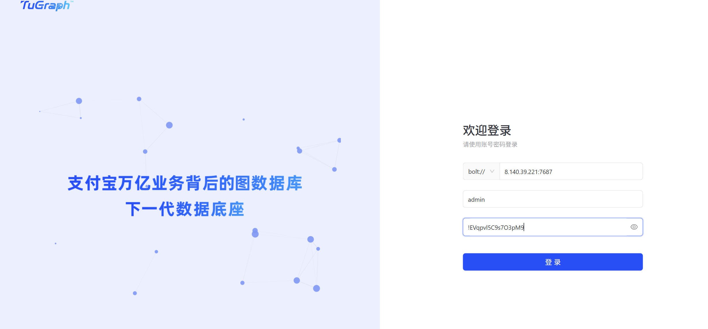
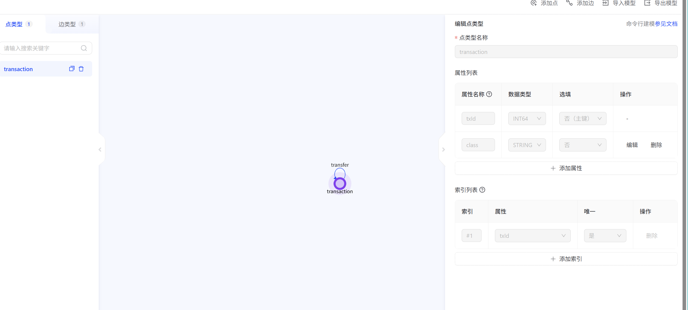
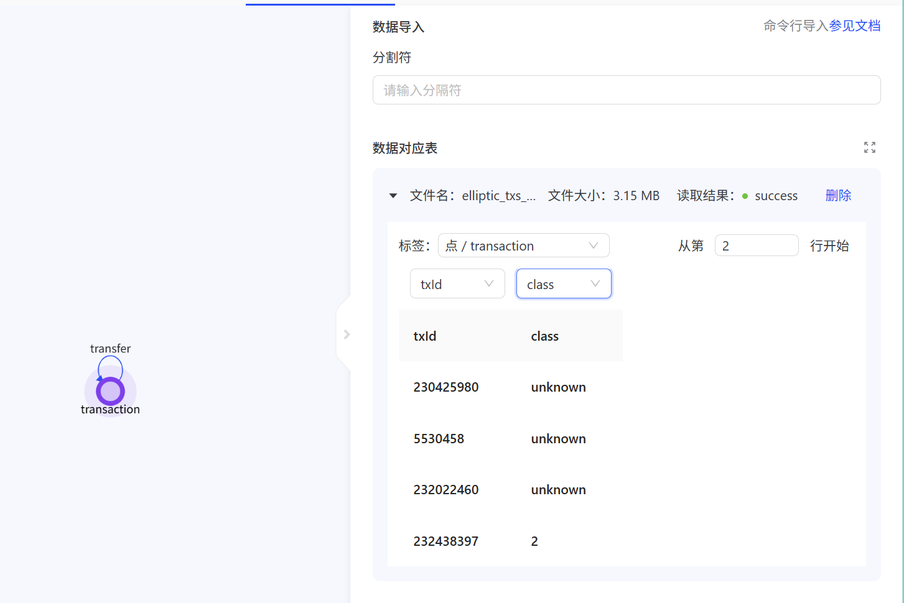
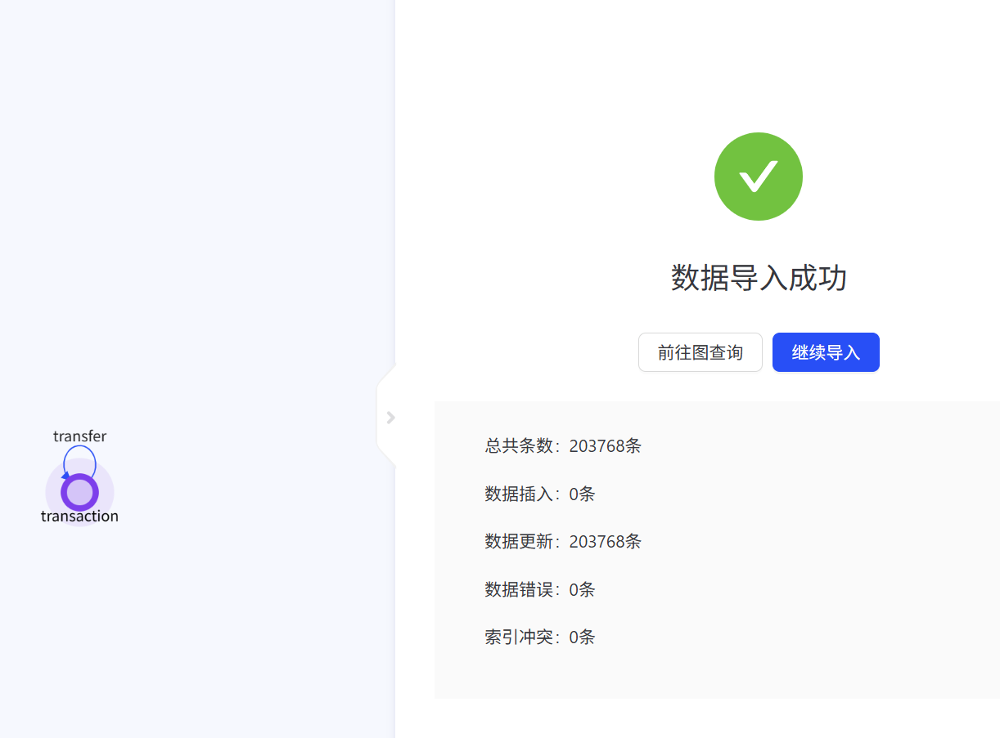
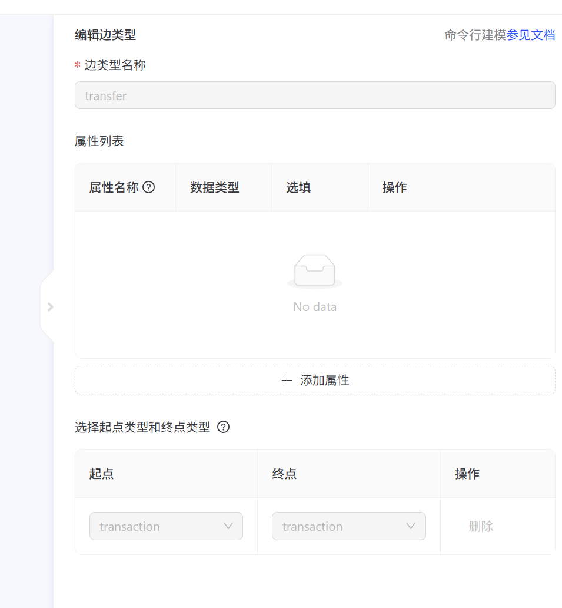
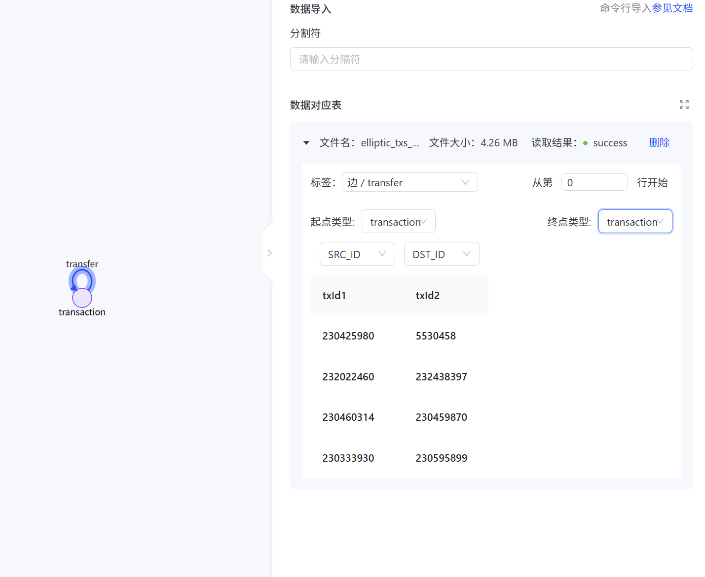
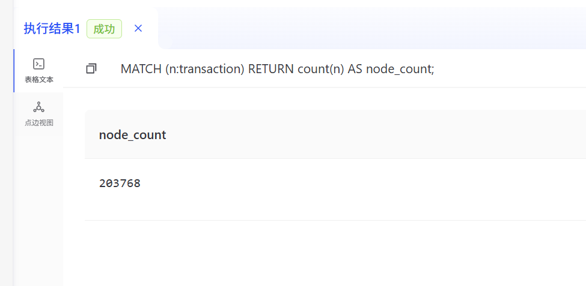
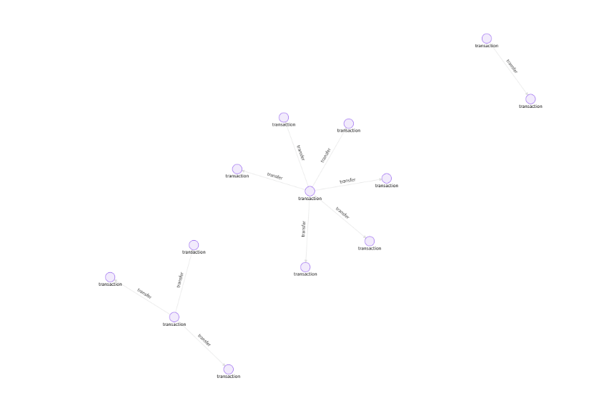
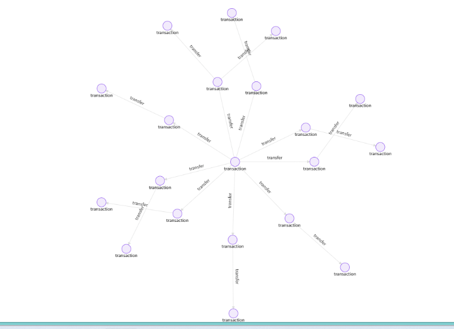
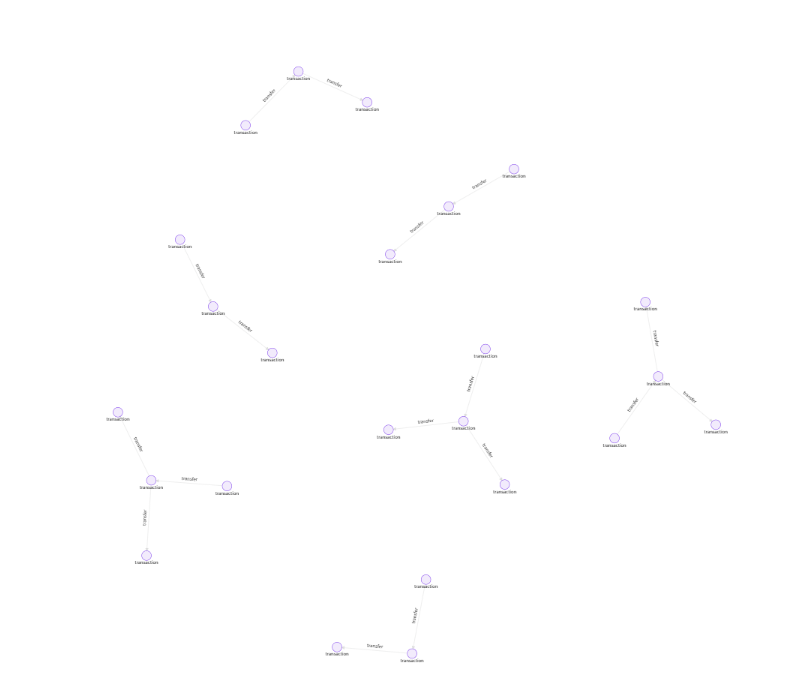

TuGraph 图数据库实验报告：tugraph数据平台基础操作学习

1. 实验基础知识

1.1 图数据库简介

图数据库是一类以图结构组织和管理数据的数据库系统，其基本组成包括点、边和属性。点通常用于表示现实世界中的实体，边用于表示实体之间的关系，属性则用于描述点或边的具体特征。与传统关系型数据库相比，图数据库更适合处理关系密集型数据，尤其适用于社交网络分析、金融交易网络分析、区块链资金流向追踪、反洗钱分析和知识图谱等场景。

在区块链交易数据中，交易之间并不是孤立存在的，而是会通过资金流向形成复杂的网络结构。如果使用传统表结构进行分析，往往需要进行多次连接查询；而使用图数据库可以直接将交易建模为节点，将交易之间的流向或关联建模为边，从而更直观地展示交易之间的连接关系。

### 1.2 TuGraph 简介

TuGraph 是一款高性能图数据库系统，支持图数据存储、图建模、数据导入、Cypher 查询和图可视化分析等功能。本实验使用 TuGraph 对 作业一 进行图建模与查询操作，主要目标是掌握图数据库的基本使用流程，包括平台启动、图项目创建、图模型设计、数据导入以及 Cypher 查询。

TuGraph 采用属性图模型，能够将节点、边及其属性统一存储和查询。在本实验中，比特币交易被表示为交易节点，交易之间的关联关系被表示为有向边，从而形成一张比特币交易网络图。

### 1.3 数据集准备

本实验使用 Transactions Dataset 数据集，主要包括两个 CSV 文件：

| 文件名 | 主要字段 | 含义 |
|---|---|---|
| `elliptic_txs_classes.csv` | `txId`, `class` | 记录交易编号及交易类别 |
| `elliptic_txs_edgelist.csv` | `txId1`, `txId2` | 记录交易之间的有向连接关系 |

其中，`elliptic_txs_classes.csv` 用于构建交易节点，`txId` 表示交易编号，`class` 表示交易类别；`elliptic_txs_edgelist.csv` 用于构建交易之间的有向边，`txId1 -> txId2` 表示从一笔交易指向另一笔交易的关系。

本次实验中，点数据文件共有约 203769 条交易记录，边数据文件共有约 234355 条交易关系记录。因此，该数据集可以自然地建模为一张比特币交易网络图。

---

## 2. 启动 TuGraph 平台

### 2.1 启动 TuGraph 服务

使用阿里云平台登录tugraph操作界面

启动成功界面如下：

<p align="center">
  
</p>
<p align="center"><b>图 1 TuGraph 服务启动成功界面</b></p>

### 2.2 登录 TuGraph 平台

打开 TuGraph Web 页面后，使用系统默认账号登录平台：

```text
用户名：admin
密码：!EVqpvl5C9s7O3pM9
```

登录成功后，可以进入 TuGraph 图项目管理页面，后续的建图、数据导入和查询操作均在该平台中完成。

登录成功界面如下：

<p align="center">
  
</p>
<p align="center"><b>图 2 TuGraph 平台登录成功界面</b></p>

---

## 3. Transactions Dataset 图建模与数据导入

### 3.1 新建图项目

进入 TuGraph 平台后，首先新建图项目。本实验新建的图项目用于存储和分析比特币交易网络数据。新建图项目后，可以继续进行图模型定义和数据导入。

图项目名称设置为：

```text
cyk_gradata
```

新建图项目界面如下：

<p align="center">
  
</p>
<p align="center"><b>图 3 新建图项目界面</b></p>

### 3.2 图模型设计

根据 Transactions Dataset 的数据结构，本实验将比特币交易网络建模为一张有向图。图模型包括一种点类型和一种边类型：

| 类型 | 名称 | 含义 |
|---|---|---|
| 点类型 | `transaction` | 表示一笔比特币交易 |
| 边类型 | `transfer` | 表示两笔交易之间的有向关系 |

`transaction` 节点的主要属性如下：

| 属性名 | 类型 | 含义 |
|---|---|---|
| `txId` | `STRING` 或 `INT64` | 交易编号，作为节点主键 |
| `class` | `STRING` | 交易类别 |

`transfer` 边的方向为：

```text
transaction(txId1) -> transaction(txId2)
```

也就是说，边数据中每一行 `txId1,txId2` 都表示一条从 `txId1` 对应交易节点指向 `txId2` 对应交易节点的有向边。由于起点和终点都属于交易节点，因此该图模型表现为 `transaction` 类型节点通过 `transfer` 边连接到另一个 `transaction` 类型节点。

图模型如下：

<p align="center">
  
</p>
<p align="center"><b>图 4 transaction 节点与 transfer 边的图模型</b></p>

### 3.3 导入点数据

完成图模型设计后，首先导入点数据。本实验将 `elliptic_txs_classes.csv` 作为点数据文件导入 TuGraph，并将其映射到 `transaction` 点类型。

点数据字段映射如下：

| CSV 字段 | 映射到 TuGraph |
|---|---|
| `txId` | `transaction.txId` |
| `class` | `transaction.class` |

导入时需要注意选择 CSV 文件第一行为表头，分隔符为英文逗号。点数据必须先于边数据导入，因为边的起点和终点需要匹配已经存在的交易节点。

点数据导入配置界面如下：

<p align="center">
  
</p>
<p align="center"><b>图 5 点数据导入配置界面</b></p>

点数据导入成功界面如下：

<p align="center">
  
</p>
<p align="center"><b>图 6 点数据导入成功界面</b></p>

### 3.4 导入边数据

点数据导入成功后，再导入边数据。本实验将 `elliptic_txs_edgelist.csv` 作为边数据文件导入 TuGraph，并将其映射到 `transfer` 边类型。

边数据字段映射如下：

| CSV 字段 | 映射到 TuGraph |
|---|---|
| `txId1` | 起点 ID，即 `SRC_ID` |
| `txId2` | 终点 ID，即 `DST_ID` |

导入边数据时，起点类型和终点类型均选择 `transaction`，并将 `txId1` 映射为起点交易编号，将 `txId2` 映射为终点交易编号。只有当边表中的起点和终点都能在已导入的点表中找到对应节点时，边才能成功导入。

边数据导入配置界面如下：

<p align="center">
  
</p>
<p align="center"><b>图 7 边数据导入配置界面</b></p>

边数据导入成功界面如下：

<p align="center">
  
</p>
<p align="center"><b>图 8 边数据导入配置界面</b></p>

---

## 4. Cypher 查询示例

TuGraph 支持使用 Cypher 语言进行图查询。Cypher 是一种声明式图查询语言，可以通过节点、边和路径模式对图数据进行匹配和返回。本实验基于已经导入的比特币交易网络，分别设计了基础查询和复杂查询。

### 4.1 基础查询：查看交易节点和交易关系数量

基础查询用于验证点数据和边数据是否成功导入。首先查询交易节点总数：

```cypher
MATCH (n:transaction)
RETURN count(n) AS node_count;
```

然后查询交易关系总数：

```cypher
MATCH ()-[r:transfer]->()
RETURN count(r) AS edge_count;
```

该查询可以用于检查数据导入是否完整。如果节点数和边数均不为 0，说明图模型中的交易节点和交易关系已经成功建立。

查询结果如下：

<p align="center">
  
</p>
<p align="center"><b>图 9 基础查询结果：交易节点数和交易关系数</b></p>

### 4.2 基础查询：查看前十条交易关系

为了直观观察交易之间的连接关系，可以查询前十条交易路径：

```cypher
MATCH p = (a:transaction)-[r:transfer]->(b:transaction)
RETURN p
LIMIT 10;
```

该语句表示匹配任意两个 `transaction` 节点之间的 `transfer` 有向关系，并返回由起点、边和终点组成的路径 `p`。通过该查询，可以直观观察比特币交易网络中的单跳交易关系。

查询结果如下：

<p align="center">
  
</p>
<p align="center"><b>图 10 基础查询结果：前十条交易关系</b></p>

### 4.3 复杂查询：两跳交易路径追踪

在完成基础查询后，进一步设计复杂查询，用于观察交易网络中的连续传递关系。相比单条边查询，两跳路径查询可以展示资金或交易关系从一笔交易出发，经过中间交易节点，再指向下一笔交易的过程。

Cypher 查询语句如下：

```cypher
MATCH p = (a:transaction)-[:transfer]->(b:transaction)-[:transfer]->(c:transaction)
RETURN p
LIMIT 10;
```

该语句表示匹配从交易节点 `a` 出发，经过中间交易节点 `b`，最终到达交易节点 `c` 的两跳路径。通过该查询，可以观察交易网络中的连续连接结构，有助于理解图数据库在区块链交易追踪、异常交易识别和资金路径分析中的应用价值。

查询结果如下：

<p align="center">
  
</p>
<p align="center"><b>图 11 复杂查询结果：两跳交易路径追踪</b></p>

### 4.4 复杂查询：特定类别交易的两跳路径

为了进一步结合交易类别进行分析，可以查询从特定类别交易出发的两跳交易路径。例如，查询 `class` 为 `1` 的交易节点出发的两跳路径：

```cypher
MATCH p = (a:transaction)-[:transfer]->(b:transaction)-[:transfer]->(c:transaction)
WHERE a.class = '1'
RETURN p
LIMIT 10;
```

该查询能够筛选出以特定类别交易作为起点的连续交易路径。如果 `class` 字段在导入时被设置为数值类型，则条件可以写为：

```cypher
WHERE a.class = 1
```

查询结果如下：

<p align="center">
  
</p>
<p align="center"><b>图 12 复杂查询结果：特定类别交易的两跳路径</b></p>

---

## 5. 实验总结

通过本次实验，我初步掌握了 TuGraph 图数据库的基本操作流程，包括平台启动、系统登录、图项目创建、图建模、数据导入以及 Cypher 查询。实验将 Transactions Dataset 建模为比特币交易网络图，其中交易记录被表示为 `transaction` 节点，交易之间的连接关系被表示为 `transfer` 有向边。

从查询结果可以看出，TuGraph 能够较为直观地展示比特币交易之间的连接关系。基础查询可以用于验证节点和边是否成功导入，并展示单跳交易关系；复杂查询可以进一步展示两跳交易路径，使交易网络中的连续传递关系更加清晰。相比传统表格数据，图数据库能够更自然地表达区块链交易网络中的关系结构，在资金路径追踪、异常交易识别和反洗钱分析等场景中具有较强的应用价值。
